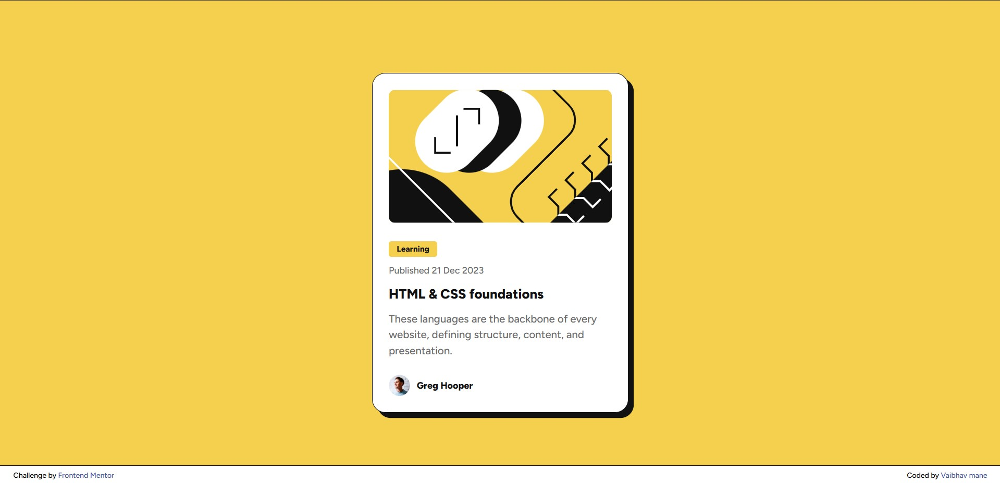

# Frontend Mentor - Blog preview card solution

This is a solution to the [Blog preview card challenge on Frontend Mentor](https://www.frontendmentor.io/challenges/blog-preview-card-ckPaj01IcS). Frontend Mentor challenges help you improve your coding skills by building realistic projects. 

## Table of contents

- [Overview](#overview)
  - [The challenge](#the-challenge)
  - [Screenshot](#screenshot)
  - [Links](#links)
- [My process](#my-process)
  - [Built with](#built-with)
  - [What I learned](#what-i-learned)
  - [Continued development](#continued-development)
  - [Useful resources](#useful-resources)
  - [AI Collaboration](#ai-collaboration)
- [Author](#author)


## Overview

This project is a responsive blog preview card component built as part of a Frontend Mentor challenge. The card features a clean, modern design with interactive hover effects and follows semantic HTML5 structure. It showcases a blog post preview with an illustration, category badge, publication date, title, description, and author information.

The design emphasizes accessibility and user experience with smooth hover transitions and proper semantic markup. The project demonstrates proficiency in CSS Flexbox for layout, custom properties for maintainable styling, and modern web development best practices.

### The challenge

Users should be able to:

- See hover and focus states for all interactive elements on the page

### Screenshot



*Screenshot will be added once the project is complete*

### Links

- Solution URL: [Add solution URL here](https://www.frontendmentor.io/solutions/responsive-blog-card-component-with-css-9F94jhHwUe)
- Live Site URL: [Add live site URL here](https://blog-preview-card-orpin-sigma.vercel.app)

## My process

### Built with

- Semantic HTML5 markup
- CSS custom properties
- Flexbox
- Google Fonts (Figtree)
- CSS hover effects
- CSS box-shadow and borders

### What I learned

This project helped me practice and learn several key concepts:

- **Semantic HTML structure**: Using `<article>` for the card container and proper heading hierarchy
- **CSS Flexbox**: For centering content and aligning author information
- **CSS custom properties**: Working with HSL color values from the style guide
- **Interactive hover states**: Creating smooth transitions for user interaction
- **CSS box-shadow**: Implementing the distinctive black shadow effect

Key code I'm proud of:

```html
<article class="blog-card">
  
  <div class="blog-card__content">
    <span class="blog-card__category">Learning</span>
    <p class="blog-card__date">Published 21 Dec 2023</p>
    <h2><a href="#" class="blog-card__link">HTML & CSS foundations</a></h2>
    <!-- More content -->
  </div>
</article>
```

```css
.blog-card__link:hover {
  color: hsl(47, 88%, 63%);
  cursor: pointer;
}

.blog-card {
  box-shadow: 8px 8px 0px hsl(0, 0%, 7%);
  border: 1px solid hsl(0, 0%, 7%);
}
```


### Continued development

Areas I want to focus on in future projects:

- **Responsive design**: Making the card work perfectly on all screen sizes
- **CSS Grid**: Exploring more complex layouts
- **Accessibility**: Adding proper focus states and ARIA labels
- **CSS animations**: Adding subtle micro-interactions
- **Performance optimization**: Optimizing images and CSS delivery


### Useful resources

- [MDN Web Docs - Flexbox](https://developer.mozilla.org/en-US/docs/Web/CSS/CSS_Flexible_Box_Layout) - Essential reference for Flexbox properties and usage
- [Google Fonts](https://fonts.google.com/specimen/Figtree) - Source for the Figtree font used in this project
- [HSL Color Picker](https://hslpicker.com/) - Helpful tool for working with HSL color values
- [CSS-Tricks - Box Shadow](https://css-tricks.com/almanac/properties/b/box-shadow/) - Great reference for understanding box-shadow syntax
### AI Collaboration

I used **Amazon Q Developer** as my AI assistant throughout this project:

**What I used:**
- Amazon Q Developer in VS Code for step-by-step guidance

**How I used it:**
- **Learning-focused approach**: Instead of asking for complete code, I requested guidance on each step
- **Debugging assistance**: Q helped identify CSS class name typos and missing units (like `px`)
- **Best practices**: Learned about semantic HTML structure and CSS organization
- **Code review**: Q checked my work and provided constructive feedback

**What worked well:**
- Step-by-step guidance helped me understand the "why" behind each decision
- Immediate feedback on mistakes helped me learn faster
- Breaking the project into phases made it less overwhelming

**What I learned:**
- The importance of matching CSS class names exactly with HTML
- How to structure a project from planning to completion
- Working collaboratively with AI while maintaining my own learning goals


## Author

- Frontend Mentor - [@vsmvaibhav](https://www.frontendmentor.io/profile/vsmvaibhav)


